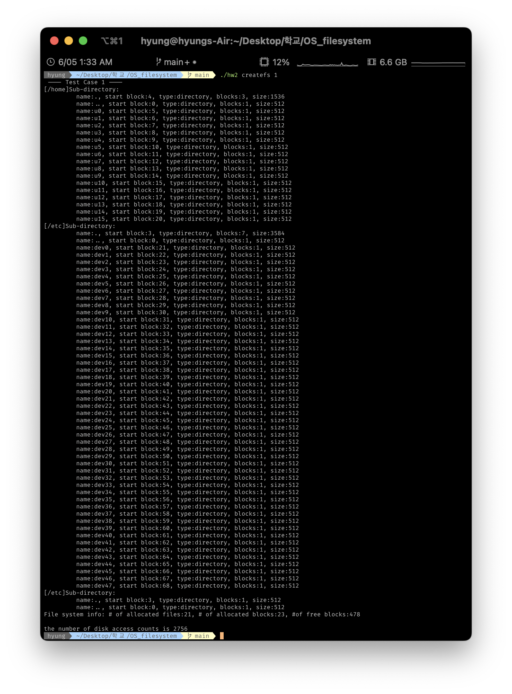
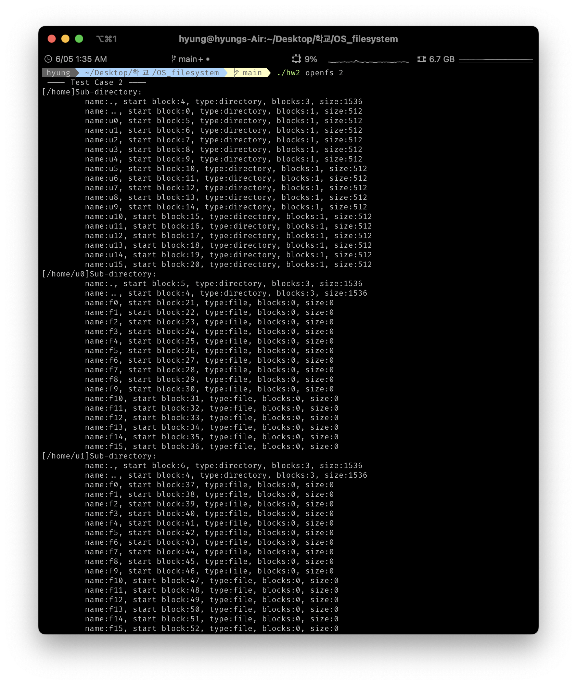
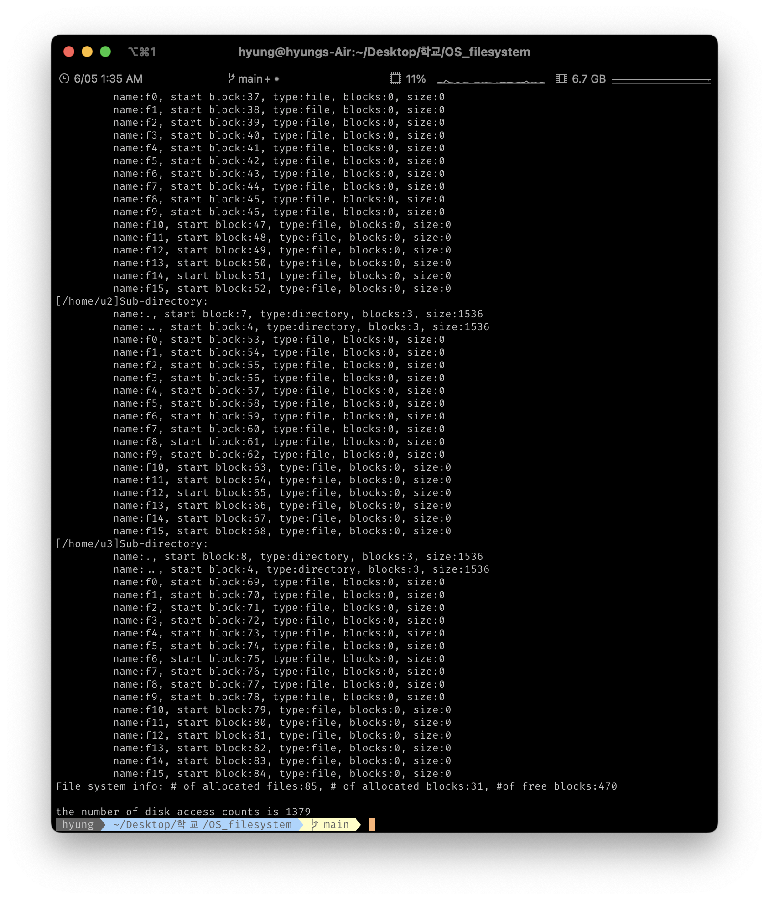
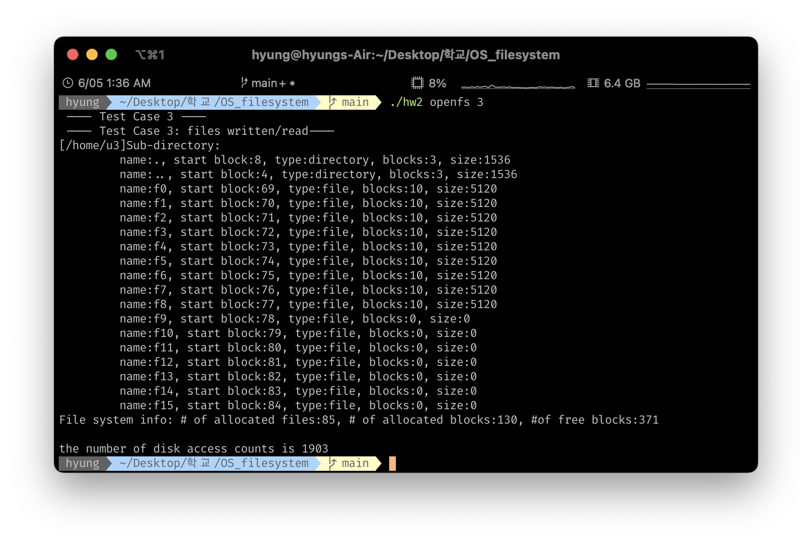
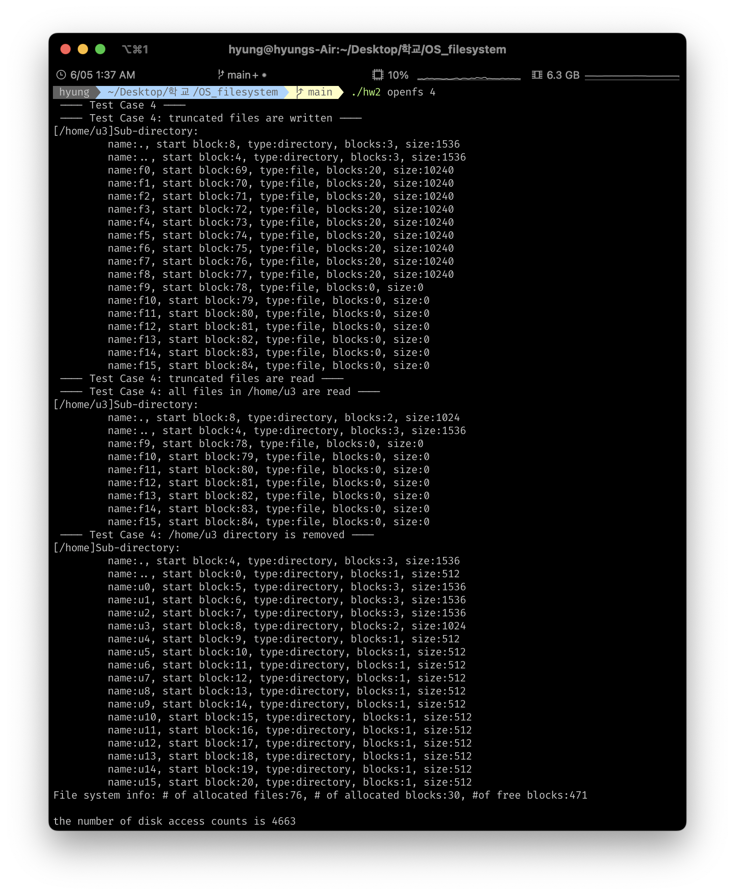

# os_filesystem
운영체제 과제 : inode를 이용한 파일시스템 구현
  

 
<h2>Testcase 1</h2> 
1) /tmp, /usr, /etc, /home 디렉토리를 생성 
 
2) /home/u0 ~ u15    디렉토리 생성, 
/etc/dev0 ~ dev47 디렉토리 생성 후 상태 출력 
 
3) /etc/dev0 ~ dev47 디렉토리 삭제 후 상태 출력 

 

<h2>Testcase 2</h2> 
/home/u0 ~ u3 디렉토리에 각각 f0 ~ f15 파일 생성
 

 

<h2>Testcase 3</h2> 
/home/u3 디렉토리의 f0 ~ f8 파일 쓰기, 읽기 후 상태 출력 
 
각 파일 당 block 10개 크기의 문자 write한 모습

 

<h2>Testcase 4</h2> 
1) /home/u3 디렉토리의 f0 ~ f8 파일 이어 쓰기 후 상태 출력 
 
2) /home/u3 디렉토리의 f0 ~ f8 파일 삭제 후 상태 출력 
 
3) /home/u3 디렉토리 삭제 
-> u3 디렉토리는 비어있지 않기 때문에 삭제 불가 

 